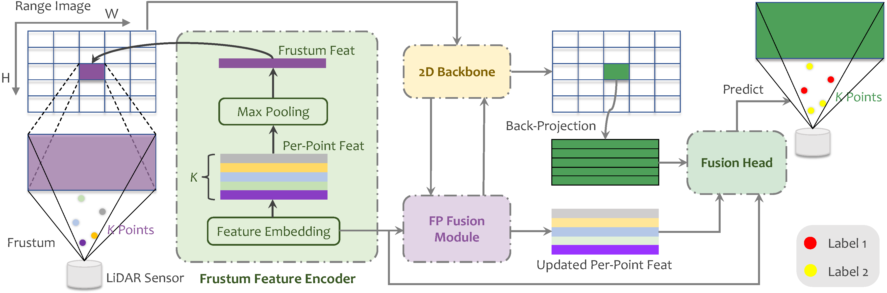

I am a Ph.D. student of [Nanjing University of Aeronautics and Astronautics](http://nuaa.edu.cn/), supervised by [Qingshan Liu](https://faculty.nuist.edu.cn/liuqingshan/zh_CN/index.htm). Before, I served as an algorithm engineer of [Leapmotor Technology](https://www.leapmotor.com/home) from July 2021 to February 2023. I obtained my Master's Degree and Bachelor's Degree at [Nanjing University of Information Science and Technology](https://www.nuist.edu.cn/main.htm) respectively, supervised by [Qingshan Liu](https://faculty.nuist.edu.cn/liuqingshan/zh_CN/index.htm). My current research is mainly focus on general 3D perception, including segmentation and detection for point cloud. Here is my [personal CV](../files/CV.pdf).

News
------------------------

- \[2023/01\] I have been invited as a collaborator on [MMDetection3D](https://github.com/open-mmlab/mmdetection3d).
- \[2022/07\] [Waterfall-Net](https://link.springer.com/chapter/10.1007/978-3-031-18913-5_3), a new point cloud segmentation paradigm network with waterfall feature aggregation, is accepted by PRCV 2022.
- \[2022/04\] [CED-Net](https://link.springer.com/article/10.1007/s00530-022-00938-2), which introduces contextual information both in shape and feature level for 3D face reconstruction, is accepted by Multimedia Systems.
- \[2021/12\] [SA-Net](https://www.spiedigitallibrary.org/conference-proceedings-of-spie/12173/1217318/Semantic-aware-object-detection-for-3D-point-cloud/10.1117/12.2634724.short?SSO=1), a semantic-aware network for point cloud object detection, is accepted by ICOMV 2022.
- \[2021/04\] [BAF-LAC](https://ieeexplore.ieee.org/abstract/document/9410334), a novel segmentation paradigm network for point cloud, is accepted by TIP.
- \[2020/07\] [Octant-CNN](http://www.aas.net.cn/article/doi/10.16383/j.aas.c200080), a general network for point cloud task, is accepted by 自动化学报.

Education
------------------------

### Nanjing University of Aeronautics and Astronautics (NUAA)

  
    April 2023 - Present 
    Ph.D. in Computer Science and Technology 
  

### Nanjing University of Information Science and Technology (NUIST)

  
    September 2018 - June 2021 
    M.S. in Control Science and Engineering 
  

### Nanjing University of Information Science and Technology (NUIST)

  
    September 2014 - June 2018 
    Major: B.E. in Electrical Engineering and Automation 
  

Publications
------------------------

### FRNet: Frustum-Range Networks for Scalable LiDAR Segmentation

  
    <strong>Xiang Xu</strong>, Lingdong Kong, Hui Shuai, Qingshan Liu 
    arXiv preprint 
    <a href="https://arxiv.org/abs/2312.04484">[Paper]</a> <a href="https://github.com/Xiangxu-0103/FRNet">[Code]</a><a href="https://xiangxu-0103.github.io/FRNet">[Project]</a> 
  

### Waterfall-Net: Waterfall Feature Aggregation for Point Cloud Semantic Segmentation

  
    Hui Shuai, <strong>Xiang Xu</strong>, Qingshan Liu 
    Chinese Conference on Pattern Recognition and Computer Vision, 2022 
    <a href="https://link.springer.com/chapter/10.1007/978-3-031-18913-5_3">[Paper]</a> <a href="https://github.com/Xiangxu-0103/Waterfall-Net">[Code]</a> 
  

### CED-Net: Contextual Encoder-Decoder Network for 3D Face Reconstruction

  
    Lei Zhu, Shanmin Wang, Zengqun Zhao, <strong>Xiang Xu</strong>, Qiangshan Liu 
    Multimedia Systems, 2022 
    <a href="https://link.springer.com/article/10.1007/s00530-022-00938-2">[Paper]</a> 
  

### Semantic-Aware Object Detection for 3D Point Cloud

  
    <strong>Xiang Xu</strong>, Gang Huang, Laifeng Hu, Yaonong Wang 
    International Conference on Optics and Machine Vision, 2022 
    <a href="https://www.spiedigitallibrary.org/conference-proceedings-of-spie/12173/1217318/Semantic-aware-object-detection-for-3D-point-cloud/10.1117/12.2634724.short?SSO=1">[Paper]</a> 
  

### Backward Attentive Fusing Network with Local Aggregation Classifier for 3D Point Cloud Semantic Segmentation

  
    Hui Shuai, <strong>Xiang Xu</strong>, Qingshan Liu 
    IEEE Transactions on Image Processing 2021 
    <a href="https://ieeexplore.ieee.org/abstract/document/9410334">[Paper]</a> <a href="https://github.com/Xiangxu-0103/BAF-LAC">[Code]</a> 
  

### 基于卦限卷积神经网络的 3D 点云分析

  
    <strong>许翔</strong>, 帅惠, 刘青山 
    自动化学报 2021 
    <a href="http://www.aas.net.cn/article/doi/10.16383/j.aas.c200080">[Paper]</a> <a href="https://github.com/Xiangxu-0103/Octant-CNN">[Code]</a> 
  

Experience
------------------------

### Leapmotor Technologies Co. Ltd.

  
    July 2021 - February 2023. Advisor: Laifeng Hu 
    Focus: Lidar perception for autonomous driving. 
  

Miscellaneous
------------------------

**Academic Services** \
I served as a reviewer for Acta Automatica Sinica (自动化学报). \
I served as a collaborator of [MMDetection3D](https://github.com/open-mmlab/mmdetection3d), work closely with [Wenwei Zhang](http://zhangwenwei.cn/).

**Hobbies** \
Love: 🏀Basketball, 🎶music, 🏸badminton, and 🏓table tennis.
